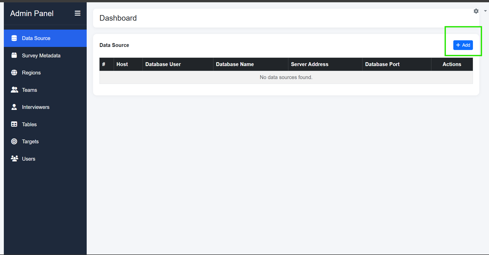
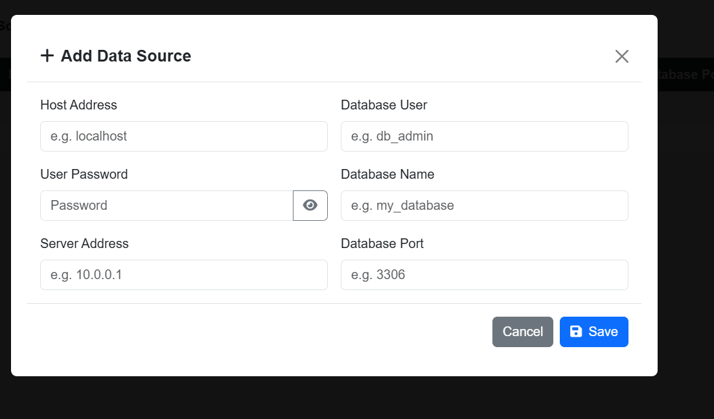

# zinaya-ME-installation-guid

**Zinaya ME** is a containerized monitoring and evaluation dashboard platform designed for managing, tracking, and visualizing survey fieldwork operations in real time.

The platform combines:

* A **FastAPI-powered data service**
* A **Flask-based interactive dashboard**
* A **MySQL backend**
* Automated database initialization
* Dockerized deployment
* Linux `systemd` service integration for production environments

Zinaya ME is designed to simplify deployment and operational management of survey monitoring systems by providing a fully automated installation workflow using Docker and shell scripting.

## Key Features

* Real-time survey monitoring dashboard
* Automated MySQL database initialization and seeding
* Docker-based deployment architecture
* Persistent database storage
* Production-ready Linux service management
* Configurable environment variables using `.env`
* Automated installation and setup script
* Shared Docker networking between services
* Built-in service restart and recovery
* Configurable ports and deployment settings

## Architecture

The platform consists of:

* **Dashboard Service**

  * Flask application
  * Runs on configurable dashboard port
  * Provides UI and analytics

* **Data API Service**

  * FastAPI backend
  * Handles data processing and API endpoints

* **MySQL Database**

  * Stores application data and configurations

* **Database Initialization Service**

  * Automatically creates:

    * databases
    * tables
    * default users
    * metadata
    * seed data

## Deployment

Zinaya ME is designed for Ubuntu/Linux servers and supports:

* Docker
* Docker Compose
* Systemd service management

The deployment process is fully automated through a shell installer script.

## Intended Use

Zinaya ME is suitable for:

* DHS-style survey monitoring
* Fieldwork supervision
* Data collection tracking
* Monitoring and evaluation operations
* Real-time survey performance dashboards
* Centralized survey administration systems

## Technologies Used

* Python
* Flask
* FastAPI
* MySQL
* Docker
* Docker Compose
* Systemd
* Bash scripting

## Goal

The goal of Zinaya ME is to provide a portable, reproducible, and production-ready monitoring environment that can be deployed quickly across multiple survey implementations with minimal manual configuration.

# Installation Steps

## Installation Guide

You are provided with a ZIP package containing all required configuration files, deployment scripts, database initialization files, and Docker container images needed to run the Zinaya ME platform.

The package includes files such as:

* `.env`
* `config.sh`
* `docker-compose.yml`
* `Dockerfile`
* `init_db.py`
* `requirements.txt`
* `dhs_data.tar`
* `dhs_dashboard.tar`

These files are used to automatically configure and deploy the Zinaya ME dashboard, data API, and database services on an Ubuntu/Linux server using Docker.
## Step 1 — Install Required Extraction Tool

Before starting the installation, ensure that the `7z` extraction tool is installed on your Ubuntu/Linux server.

Run the following commands:

```bash
sudo apt update
sudo apt install -y p7zip-full
```

---

## Step 2 — Extract the Deployment Package

Extract the provided ZIP package:

```bash
7z x config.zip
```

This will create a folder named:

```bash
config
```

---

## Step 3 — Navigate to the Extracted Folder

Move into the extracted directory:

```bash
cd config
```

---

## Step 4 — Make the Installation Script Executable

Grant execution permissions to the deployment script:

```bash
chmod +x config.sh
```

---

## Step 5 — Run the Installation Script

Start the automated deployment process:

```bash
sudo ./config.sh
```

The script will automatically:

* Install Docker (if not already installed)
* Configure Docker services
* Create the required Docker network
* Initialize the MySQL database
* Load the provided Docker images
* Create and start system services
* Deploy the Zinaya ME dashboard and data API services

## Accessing the Zinaya ME Dashboard

Once the installation is completed successfully, the dashboard can be accessed using:

```text
http://<server-IP>:<dashboard-port>
```

Example:

```text
http://192.168.1.10:18000
```

---

## Check the Server IP Address

If you are not sure about the server IP address, run:

```bash id="1m5dqq"
hostname -I
```

This will display the available server IP addresses.

Example output:

```text
192.168.1.10
```

---

## Check the Dashboard Port

If you are not sure about the dashboard port, check the `.env` file:

```bash id="jlwm8q"
cat .env
```

Look for:

```env
DASHBOARD_PORT=18000
```

Use the displayed value as the dashboard port in the URL.

---

## Final Access URL Example

```text
http://192.168.1.10:18000
```

Open the URL in your browser to access the Zinaya ME dashboard.

## Troubleshooting — Port Already in Use

If the installation script reports that a port is already in use, you will need to change the conflicting port in the `.env` file.

The installation script will normally display the busy port, for example:

```text id="px2l3r"
ERROR: Port 18000 is already in use.
```

---

## Step 1 — Open the `.env` File

Run:

```bash id="xjlwm8"
sudo nano .env
```

---

## Step 2 — Locate the Busy Port

Look for entries such as:

```env id="0lwyxh"
DATA_PORT=17000
DASHBOARD_PORT=18000
```

---

## Step 3 — Change the Busy Port

Replace the busy port with another unused port number greater than `15000`.

Example:

```env id="fjlwm9"
DASHBOARD_PORT=18100
```

or:

```env id="jlwm4x"
DATA_PORT=17100
```

Choose a port that is:

* Not already in use
* Greater than `15000`

---

## Step 4 — Save and Exit

In `nano`:

* Press `CTRL + O` → save
* Press `ENTER`
* Press `CTRL + X` → exit

---

## Step 5 — Run the Installation Again

```bash id="jlwm1p"
sudo ./config.sh
```

The installation will continue using the updated ports.

## Additional Support

If the issue persists after following the troubleshooting steps, or if you encounter a different installation error, please contact support by sending an email to:

```text id="5jlwmc"
sjnitiema@hotmail.com
```

When reporting the issue, include:

* The error message displayed
* A screenshot (if possible)
* The installation step where the error occurred
* Any relevant terminal logs

This will help speed up troubleshooting and support.
# Login

Once the dashboard is running, you can access the system using the default administrator account:

```text id="rjlwm4"
Username: admin
Password: admin@survey
```

After logging in, you will be redirected to the Admin Panel.

---

## Adding a Data Source


 Click the **+ Add** 

This will open the **Add Data Source** form.


Fill in the required database connection details:

## Data Source Fields Explanation

### 1. Host Address

The IP address of the server where the survey Mysql database is installed.

Examples:

```text
192.168.1.20
```
This is the machine hosting the survey database.

---

## 2. Database User

The MySQL username used to access the survey database.

Example:

```text
root
```

or another database user account created for the survey system.

---

## 3. User Password

The password associated with the selected database user.

This password is required for database authentication.

---

## 4. Database Name

The name of the survey database containing the survey data.

Example:

```text
survey_db
```

Ensure the name matches the exact database created on the MySQL server.

---

## 5. Server Address

The IP address of the server where the Zinaya ME platform is installed and running.

This is the server users will use to access the Zinaya ME dashboard.

Example:

```text
192.168.1.50
```

---

## 6. Database Port

The MySQL database port used by the survey database server.

Default MySQL port:

```text
3306
```

If the database server uses a custom port, provide that value instead.

---

# Saving the Data Source

After filling in all required fields:

1. Review the information carefully
2. Click the **Save** button

Once saved successfully, the data source will appear in the data source table and become available for dashboard operations.
